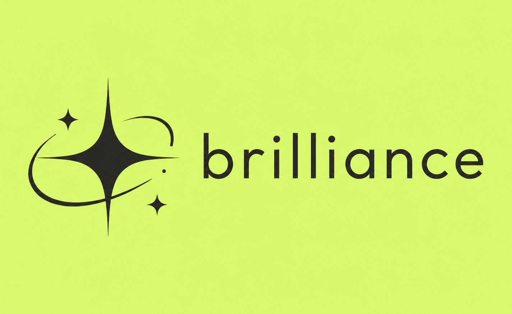
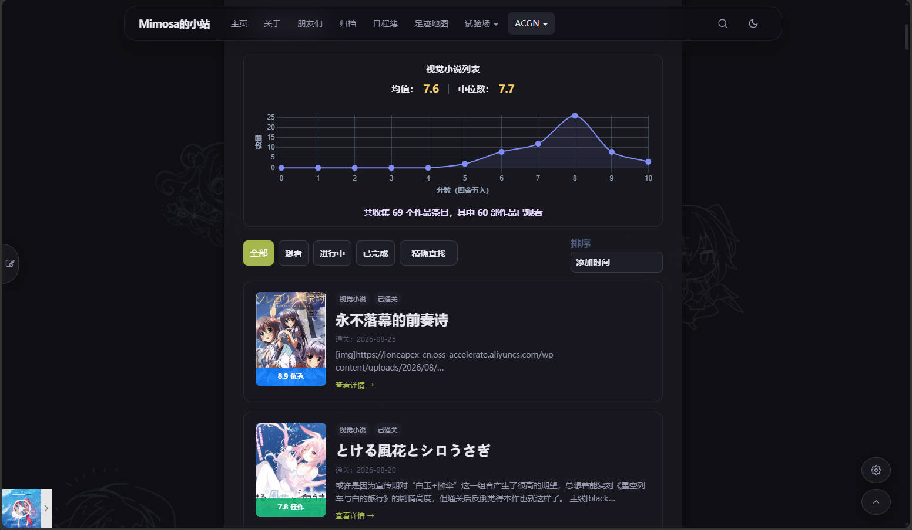
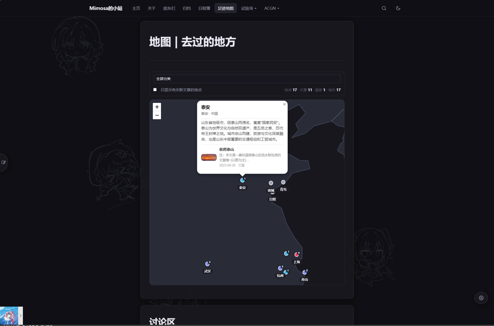
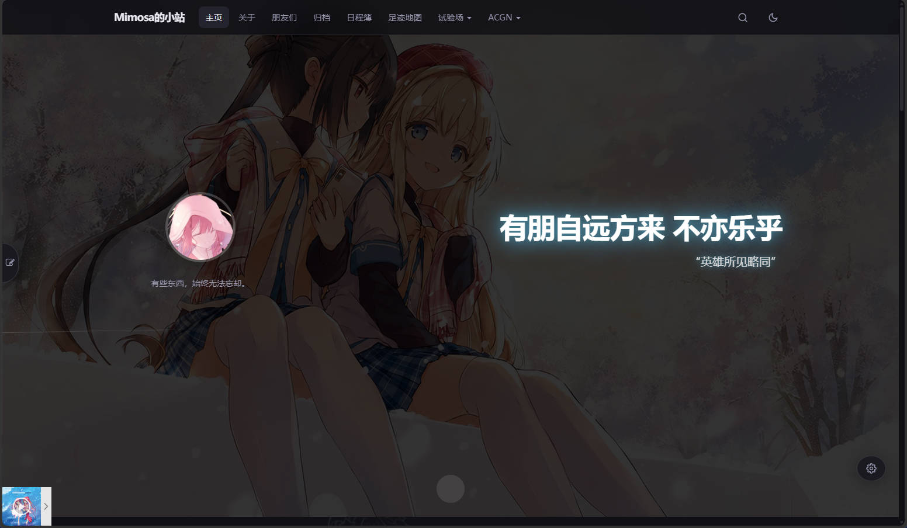
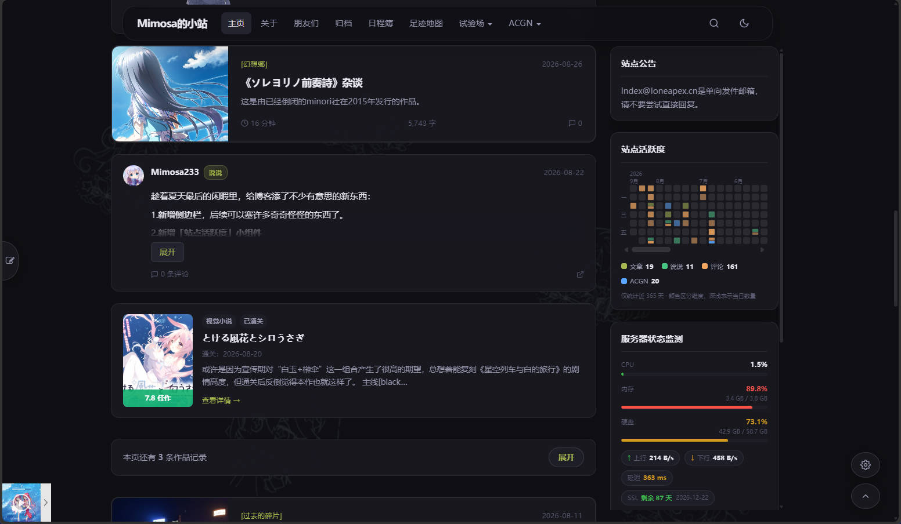
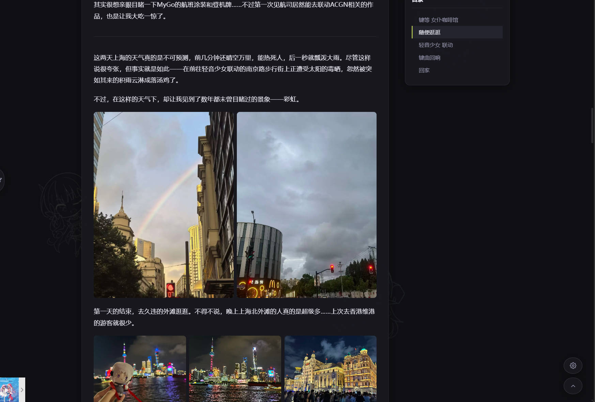
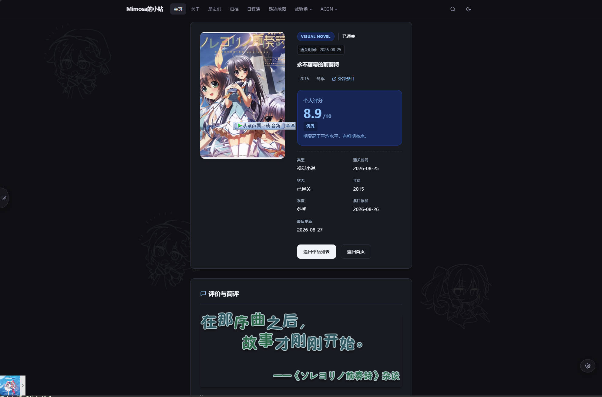
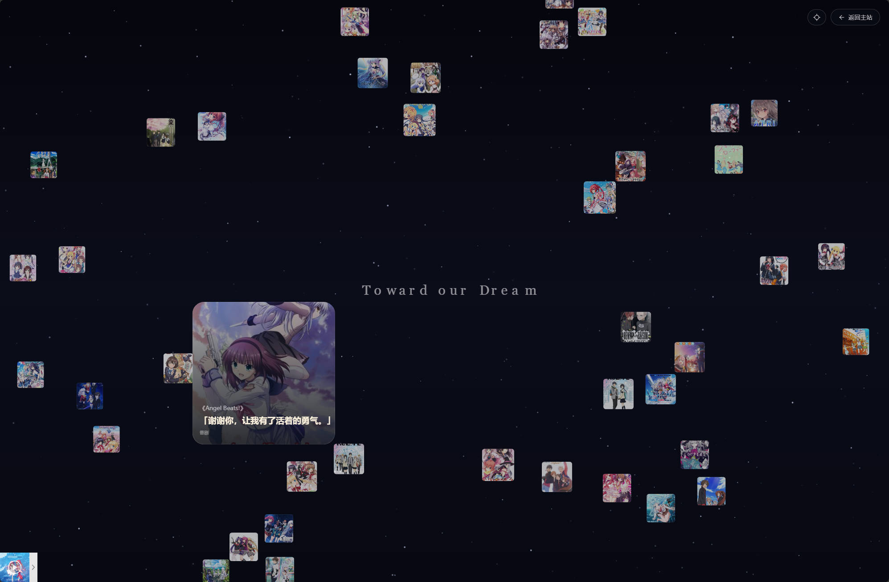
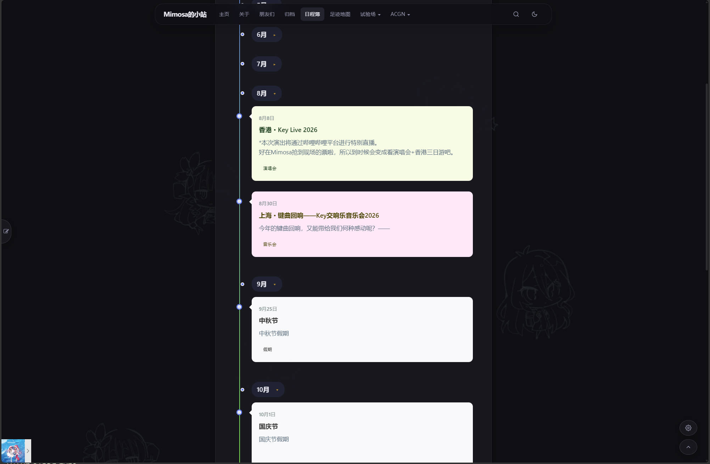

# Brilliance Theme

> **轻量而不简陋，克制而不失美感。**
> 一个更适合 ACGN 爱好者的 WordPress 博客主题。

Brilliance 是一个基于 WordPress 的个人博客主题。

它并不试图成为一个「什么都能做」的万能主题，而是希望在保持博客本身简洁、易用的基础上，为喜欢 **ACGN、个人记录、旅行与长期写作** 的用户提供一些更有趣的内容组织方式。

本主题大部分代码由AI辅助编写。

**在使用前建议阅读[使用文档](https://docs.loneapex.cn/)**

---

## ✨ 特色功能

### ACGN 系统

为喜欢记录动画、漫画、游戏、Galgame、轻小说等作品的使用者设计。

* **作品管理**

    * 自主录入与管理 ACGN 作品
    * 支持动画、漫画、游戏、Galgame、轻小说等类型
    * 支持评分、标签、状态、封面等信息

* **独立详情页**

    * 每部添加的作品拥有独立的详情页面
    * 可以记录作品信息与个人评价
    * 支持撰写完整的长篇评测

* **印象集**

    * 将作品记录转换为可视化的「记忆星空」
    * 以更加自由、沉浸的方式浏览自己的 ACGN 记忆
    * 不只是一个数据库，也是属于自己的作品记忆档案

---

### 足迹地图（独立页面）

把博客文章与现实世界中的地点联系起来。

* 为文章添加地理位置
* 在地图上浏览自己的文章记录
* 根据地点反查相关文章
* 支持添加没有对应文章的独立地点，以及对每个地点添加注释文章
* 可以作为旅行记录，也可以作为属于自己的「记忆地图」

对于旅行、圣地巡礼以及长期个人记录来说，这个地图不只是一个导航工具，而是另一种整理记忆的方式。

---

### 互动与社区

除了传统博客文章之外，Brilliance 也提供了一些更加轻量的互动方式。

* **说说**

    * 独立于长文章的短内容系统
    * 适合记录碎片化想法与日常动态
    * 可以与文章流混排

* **增强评论系统**

    * Markdown
    * 自建 BBCode
    * 评论编辑
    * 评论表情贴纸
    * 邮件通知 HTML 美化

* **ACGN 风格验证码**：使用「角色发色选择」代替传统验证码

* **文章 Emoji 互动**：读者可以匿名为文章添加 Emoji 表情

---

### 实用工具

Brilliance 还包含一些适合个人博客长期使用的工具。

* **日程时间轴（独立页面）**

    * 日历事件管理
    * 以时间轴形式展示个人日程

* **服务器状态探针**

    * 静态缓存机制
    * 展示服务运行状态
    * 尽可能降低对服务器本身的影响

* **丰富的短代码**

    * 折叠区块
    * 提示 / 警告框
    * 待办事项
    * ACGN 引用卡片
    * 文章引用卡片
    * 更多博客排版组件

* **视觉增强**

    * 背景悬浮贴图
    * 图片灯箱
    * 深色 / 浅色主题
    * 多种博客页面展示方式

---

## 标准博客功能

Brilliance 并不是一个只能展示 ACGN 数据的「特殊主题」。

作为一个完整的 WordPress 博客主题，它同样提供常见的博客基础功能：

* 文章分类与标签
* 文章时间轴
* 友链系统
* 评论系统
* 图片灯箱
* 深色 / 浅色模式
* 响应式布局
* 首页文章流
* 独立页面
* 说说
* 自定义页面组件
* 丰富的文章排版能力

你可以把它当作一个普通的 WordPress 博客主题使用，也可以逐渐启用其中更具个性的功能。

---

## 在线预览

👉 **[Mimosa's Blog](https://loneapex.cn/)**

这是 Brilliance 的实际使用环境，同时也是该主题许多功能最初诞生的地方。

---

## 界面预览

以下截图基于 **Brilliance 1.0.0**。

### 首页

*Banner 与首页视觉效果*

### 首页文章流

*文章、说说与 ACGN 预览卡片混排*

### 文章页面

*文章阅读页面*

### ACGN 列表

*ACGN 作品管理与展示*

### ACGN 详情页

*独立作品详情页面*

### 印象集

*「记忆星空」印象集*

### 足迹地图

*文章与地点组成的记忆地图*

### 日程时间轴

*个人日程时间轴*

---

